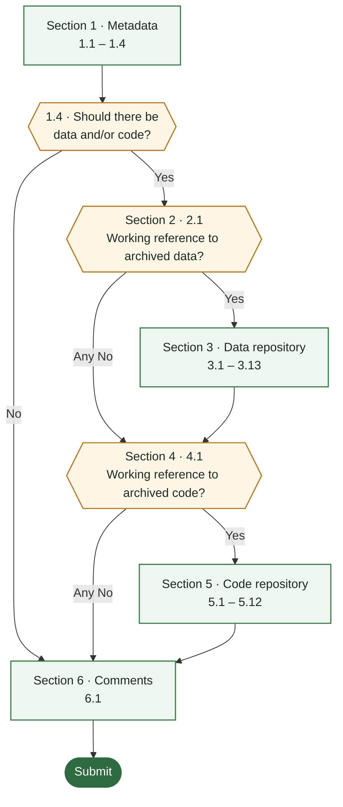

# 🐉 SORTEE 2026 Hackathon — Data & Code in Ecology and Evolution Society Journals: FAQ and Guide

> **Quick links:** [Introduction](#introduction) · [Contributions](#contributions) · [Before you start](#before-you-start) · [Form flow](#how-the-form-flows) · [General FAQ](#general-faq) · [Section 1](#section-1--metadata) · [Section 2](#section-2--is-there-a-data-repository) · [Section 3](#section-3--data-repository) · [Section 4](#section-4--is-there-a-code-repository) · [Section 5](#section-5--code-repository) · [Section 6](#section-6--comments)

---

## Introduction

This hackathon, led by the **SORTEE Advocacy Committee**, looks at **data and code availability and sharing quality in journals published by ecology and evolution societies**. Many of these journals now require or encourage authors to share the data and code behind their published papers, but how well that works in practice varies. Some of these journals also have Data Editors who check the data and code during the publication process.

Working through a shared set of papers published between January and September 2026, participants record whether each paper's data and code are **archived, accessible, licensed and documented**, using a Google Form. This guide explains every question on that form and how to handle the edge cases. The method follows our pre-registration: _Link to follow._ The sample covers 89 journals and 1,442 papers: 15 per journal for most journals, all papers for journals that published fewer than that, and up to 30 for the ten journals with data editors. Each participant will be given their **own file** containing a list of papers allocated to them, each with its own manuscript ID.

The aim is to write a manuscript on the state of data and code archiving in society journals. Contributions, and authorship, are tracked using Dragon Kill Points (see [Contributions](#contributions)).

If you have any problems, check this FAQ first, then message one of the organisers by email or on Slack.

Ed Ivimey-Cook: e.ivimeycook@gmail.com
Joel Pick: joel.l.pick@gmail.com

---

## Contributions

We invite researchers at any career stage with a background in ecology and/or evolutionary biology to contribute to the project. All contributions will be acknowledged. Significant contributions (as outlined below), will warrant co-authorship. The final number of authors will depend on the individual contributions warranting authorship. The expected time you may spend on data extraction for this project is expected to be around ~5 hours in total, but will ultimately depend on the number of articles for data extraction, the final number of contributors, and the complexity of extractions. We also expect co-authors to contribute time to giving feedback on the final manuscript.

We welcome and actively encourage the participation of researchers from historically underrepresented and marginalized groups, valuing their unique perspectives and experiences as essential contributions to this work.

Co-authorship requires all the below contributions and responsibilities. To be a co-author, you will need to:

- Fill in the Expression Of Interest (EOI) form at the start of the project.
- Gain 60 DKP (outlined below; data extractions must be of good quality) from a subset of articles, as assigned. The DKP (per person) has been determined by the desired sample size and the estimated time to complete each task.
- Read and approve of the final manuscript draft before submission in a timely manner (feedback is encouraged at every stage of the project).
- Disclose personal information (e.g. name, affiliation, ORCID, email, languages, society memberships) and conflicts of interest needed prior to submission in a timely manner.
- Agree to be personally accountable for your contribution as a co-author.

**Note:** First and last authorship positions in the manuscript will be held by the project leads (EIC and JLP). Other authorship positions will be determined by the total amount and quality of contributions. The order of mid-authorship will be alphabetical. All authors must read and approve the final manuscript draft before submission. The manuscript will contain a CRediT-like statement detailing the roles of individuals. 

### Dragon Kill Points (DKP)

We track contributions using **Dragon Kill Points (DKP)** [Martinig et al. 2026](https://doi.org/10.1186/s12915-026-02521-x), a transparent, points-based system adapted from multiplayer gaming. It is built on five **GREAT** principles:

- **Granularity** — record contributions at a detailed task level so nothing is under-counted;
- **Responsibility** — authorship criteria are agreed at the outset;
- **Equity** — the same rules apply to everyone, regardless of career stage;
- **Autonomy** — contributors can query or change their position as the project progresses;
- **Transparency** — the contribution record is shared with the whole team throughout.

For this hackathon, points are awarded based on how much is extracted per paper:

| Task | Points | When |
|---|---|---|
| **Searching for data and code links** | 1 | If the paper is expected to have data and/or code. Q1.4  = **YES** and so you search it for data and code links (2.1 and 4.1). |
| **Data repository extraction** | 1 | If there is archived data (2.1 is **Yes**), so you also extract information about the data repository (Section 3). |
| **Code repository extraction** | 1 | If there is archived data (4.1 is **Yes**), so you also extract information about the code repository (Section 5). |
| **Journal policy** | 1 | Extracting data on a society journal's data and code policy done by the Advocacy Committee before the hackathon. |

**What a paper is worth**

| What you find | Points |
|---|---|
| 1.4 is **No** (e.g. a review or opinion piece) | 0 |
| 1.4 is **Yes**, but no working data or code reference | 1 |
| 1.4 is **Yes**, data repository only | 2 |
| 1.4 is **Yes**, code repository only | 2 |
| 1.4 is **Yes**, data **and** code repositories | 3 |

**Authorship threshold:** **60 DKP**, together with the other requirements above. Anyone who extracts but does not gain 60 DKP will be acknowledged.

---

## Before you start

- **Assess what is there, not what should be there.** You are recording what a reader can find and use today — don't try to fix links or contact authors about anything.
- **When in doubt, pick the most defensible answer and explain it in the comments box** for that section (3.13, 5.12 or 6.1). Comments are extremely useful to us when we clean the data.
- Questions marked **\*** are mandatory.

---

## How the form flows

<!--  -->

<!--  -->

Note that **data and code are assessed separately**, even when they live in the same repository. If one Zenodo record contains both, you will visit it in Section 3 *and* again in Section 5 — that is intended.

---

## General FAQ

**How long should one assessment take?**
We're thinking this should take a maximum(!) of 10 mins per paper.

**Should I run the code or check the data reproduce the results?**
No. This form assesses **availability and documentation**, not computational reproducibility.

**Should I contact the authors if something is missing?**
No. Record what you find.

**I made a mistake in a submission. What do I do?**
Contact the organisers by email, or during the event via the Zoom chat or the Slack channel, with the manuscript ID and what needs correcting.

**I can't get access to the paper (paywall).**
Try your institutional access or the journal's open-access version first. If you still can't read it, don't assess it: submit its manuscript ID through the Google Form we will provide (_link to follow_) so it can be given to someone else, and move on to your next paper. Don't use unofficial copies.

**I've been allocated a paper I have a conflict of interest with.**
You can't assess a paper if you:

- are an **author** or **co-author** of it;
- are a close collaborator of its authors; or
- hold a **position at the journal** that published it (e.g. editor, associate editor, data editor, editorial board member).

Don't assess it: submit its manuscript ID through the Google Form we will provide (_link to follow_) so it can be given to someone else, and move on to your next paper.

**The PDF and the journal web page give different links.**
Use the journal web page (the version of record online), which is usually more up to date, and note the difference in 6.1.

**Will anyone else assess the same paper?**
Potentially — There is a chance that your paper could be extracted by another extractor in order to assess repeatability. 

**Where do I ask questions during the event?**
The Zoom chat or the dedicated Slack channel.

---

## Section 1 — Metadata

### 1.1 What is your name? \*
**What to do:** Enter your name. Please keep it the same for every extraction.

**FAQ**
- *Does the exact spelling matter?* Yes — use exactly the same name every time (e.g. always "Jo Smith", not sometimes "J. Smith"). Your points are counted by matching names.
- *Why do you need my name?* So we can credit you (see [Contributions](#contributions)).
- *I'm assessing multiple papers — do I enter it every time?* Yes, one form submission per manuscript.

### 1.2 What is the ID of the manuscript? \*
**What to do:** Enter the manuscript ID exactly as it appears in your file.

**FAQ**
- *Where do I find the ID?* In your file, next to the paper title.

### 1.3 DOI of MS \*
**What to do:** Enter the article DOI.

**FAQ**
- *What format?* Either `10.xxxx/xxxxx` or the full `https://doi.org/10.xxxx/xxxxx` is fine.
- *Where do I find it?* Usually on the first page of the PDF or at the top of the journal web page.
- *The paper has no DOI.* Paste the article's URL instead and mention this in 6.1.

### 1.4 Should there be data and/or code associated with the paper? \*
**What to do:** Answer **Yes** if the paper analyses data (empirical work) or presents theory/simulations that rely on code. Answer **No** for reviews, opinion pieces, perspectives, editorials, etc.

**FAQ**
- *It's a meta-analysis.* **Yes** — meta-analyses analyse extracted data.
- *It's a purely mathematical/analytical theory paper with no simulations.* Usually **No**, unless the paper mentions code (e.g. numerical solutions). If it does, answer **Yes**.
- *It's a review that includes a small quantitative analysis or a systematic literature search.* **Yes** — there is data behind it.
- *It's a methods or software paper (e.g. introducing an R package or a new statistical method).* **Yes** — there is code behind it, and usually example data.
- *A comment or reply that re-analyses the original paper's data.* **Yes.** A comment with no new analysis is **No**.

➡️ **Yes** → Section 2. **No** → Section 6.

---

## Section 2 — Is there a Data repository?

### 2.1 Is there a working reference to archived data in the MS? \*
**What to do:** Search the manuscript for "data" and read the **Data Availability / Open Research statement**, the **Methods**, and the **Supplementary Material** list. Try every link given.

| Option | Choose when… |
|---|---|
| **Yes** | The link/accession works and leads to data, *or* the data are in the supplementary files. |
| **No, link(s) that doesn't work** | Data are referenced but the link is broken, leads to a 404, a login page where you can't see the dataset at all, or a generic landing page with no way to find the dataset. |
| **No, sensitive data so not shared** | The authors explicitly state data are withheld for ethical, legal, or conservation reasons (e.g. endangered species locations, human participants). |
| **No, no reference** | No mention of archived data, *or* only "available from the authors on (reasonable) request". |

**FAQ**
- *"Data available on request" — which option?* **No, no reference.** Data on request are not archived. Mention it in 6.1.
- *The data are described as sensitive **and** available on request.* **No, sensitive data so not shared** when the authors give a reason (e.g. protected species, human participants); **No, no reference** when there is only "on request" with no reason.
- *The link reaches the dataset's own page, but downloading needs a login or an access request.* **Yes** here — the reference works. Answer **No** at 3.8.
- *The DOI works but resolves to a private/embargoed record.* **Yes** here — the reference works. You'll record the access problem at 3.8.
- *Only some of the data are archived.* **Yes**, and explain what's missing in 3.13.
- *The statement says data "will be made available" or "will be deposited upon publication", but there is no working link.* **No, no reference** — a promise is not an archive. Quote the statement in 6.1.
- *The link is a private "reviewer" link (e.g. a Dryad or Figshare review URL) left in the published paper.* If it still opens the dataset, **Yes**, and note in 3.13 that it is a reviewer link. If it no longer works, **No, link(s) that doesn't work**.
- *The data come entirely from an existing public database (e.g. GBIF, a previously published dataset) and the paper cites it.* **Yes** if a working link/accession to the specific data used is given; otherwise **No, no reference**. Note it in the comments.

➡️ **Yes** → Section 3. **Any "No"** → Section 4.

---

## Section 3 — Data Repository

### 3.1 Is the data stored across multiple repositories? \*
**What to do:** Answer **Yes** if data are split across more than one location (e.g. Dryad + GenBank, or Zenodo + Supplementary Material).

**FAQ**
- *Is a GitHub repo that is also archived on Zenodo "multiple repositories"?* **No** — that's one resource in two places. Treat the **Zenodo** version as the repository (it has the permanent ID).
- *Raw sequence reads on NCBI plus processed data on Dryad?* **Yes.**

### 3.2 If there are multiple repos, please select one as the primary and justify your selection below
**What to do:** Only answer if 3.1 = Yes. Pick **one** repository to assess for the rest of the section, using this priority order:

1. The repo where **data and code are stored together**.
2. The repo that holds the data the **analysis directly uses** (i.e. processed data).
3. The repo holding **most** of the data.

Briefly say which rule you used, e.g. *"Zenodo chosen: data and code together; raw reads on NCBI."*

### 3.3 What is the repository? \*
**What to do:** Select the repository you are assessing. The options are listed below in the same order as on the form:

| Option | How to recognise it |
|---|---|
| **DataVerse** | A Dataverse site, e.g. Harvard Dataverse (DOIs starting `10.7910/DVN`) or Borealis (Canada) |
| **Dryad** | datadryad.org; DOI starts `10.5061/dryad` |
| **Figshare** | figshare.com; DOI starts `10.6084/m9.figshare` |
| **GitHub/GitLab/Bitbucket/Codeberg** | github.com, gitlab.com, bitbucket.org or codeberg.org. If it is archived on Zenodo, choose **Zenodo** instead (see 3.1) |
| **GenBank/NCBI etc** | Sequence or genomic accessions, e.g. GenBank, SRA, BioProject, ENA |
| **Institutional repository** | A university or institute data store, e.g. Edinburgh DataShare, Pure |
| **OSF** | osf.io; DOI starts `10.17605/OSF.IO` |
| **Personal Website** | Files on an author's or lab's own website, e.g. a download link on a personal or lab page, Google Sites, a university staff page |
| **ScholarWorks** | A repository branded "ScholarWorks" (used by several universities) — choose this rather than Institutional repository |
| **Supplementary Material** | The journal's Supporting Information files |
| **Zenodo** | zenodo.org; DOI starts `10.5281/zenodo` |
| **Other** | Anything else, e.g. Pangaea, Mendeley Data — name it in the box |

### 3.4 Paste URL of the repository \*
**What to do:** Copy the URL from your browser's address bar **after** following the link — i.e. the actual landing page, not the DOI string from the paper.

### 3.5 Is there a Permanent ID? \*
**What to do:** Answer **Yes** if the dataset has a persistent identifier such as a **DOI**, an **accession number** (e.g. GenBank, SRA), or a **Handle**.

**FAQ**
- *GitHub?* **No.** A GitHub URL is not a permanent identifier — repos can be renamed, edited or deleted. (If the GitHub repo has been archived to Zenodo, you should be assessing the Zenodo record — see 3.1.)
- *OSF project?* OSF projects can be registered or given a DOI. Answer **Yes** only if a DOI is shown on the project page.
- *Personal website?* **No.** A website URL is not a permanent identifier — pages can move or disappear when people change jobs.
- *Supplementary material?* Answer **No** unless the supplementary file has its own DOI (some publishers, e.g. those using Figshare-hosted supplements, assign one). The article's DOI does not count.

### 3.6 If yes, what is the Permanent ID?
**What to do:** Paste the DOI/accession, e.g. `10.5061/dryad.xxxxxxx`.

**FAQ**
- *There are many accession numbers (e.g. one per sequence).* Paste the project- or study-level accession if there is one (e.g. a BioProject `PRJNA…` number); otherwise paste the first and list the rest, or the range, in 3.13.

### 3.7 Is there a license? \*
**What to do:** Look for a licence file or a licence mentioned on the repository page. For reference, all Dryad projects have CC0 licences by default, but they may not be included in the files. Licence files typically include CC licences (e.g. CC-BY-4.0 or CC0), MIT, Apache or GNU GPL.

**FAQ**
- *Dryad.* Dryad publishes all data under CC0, even if no licence file is included — answer **Yes**.
- *Zenodo / Figshare / OSF.* The licence is usually shown on the landing page sidebar (e.g. "Creative Commons Attribution 4.0 International"). If one is shown → **Yes**.
- *A code licence (e.g. MIT, GPL) on a data repository.* Still counts as **Yes** — any stated licence does.
- *"All rights reserved" / a copyright notice only.* **No** — this isn't an open licence. Note it in 3.13.
- *Supplementary material.* Answer **Yes** only if a licence is stated for the supplement (sometimes the article's CC-BY licence explicitly covers supplementary files — if so, say so in 3.13).

### 3.8 Are data archived and downloadable? \*
**What to do:** Can you see data files **and** start downloading them?

Answer **No** if the repo is **private**, **embargoed**, requires a **login or request** to access, or the files are **empty or corrupt**.

**FAQ**
- *You can see the dataset's page and file list, but downloading needs a free account (e.g. Movebank, some institutional repositories).* **No** — the data aren't openly downloadable. Name the repository and the access condition in 3.13.
- *The download is enormous.* If the download starts, answer **Yes** — no need to finish it.
- *Files are compressed (.zip, .tar.gz).* Download and unzip if reasonably sized so you can answer 3.9–3.12. If it's too large, answer based on the file listing and note this in 3.13.

### 3.9 What format are the data in? \*
**What to do:** Tick **all** formats present, based on the file suffixes. If unsure, use **Other** and separate multiple formats with `;`.

| Option | Examples |
|---|---|
| Tabular data | `.csv`, `.tsv` |
| Interoperable spreadsheet | `.xlsx`, `.ods` |
| Proprietary spreadsheet | `.xls` |
| Text | `.txt` |
| Statistical software file | `.sav`, `.dta`, `.rds`, `.Rdata`/`.rda` |
| Image | `.png`, `.jpg`, `.tiff` |
| Video | `.mp4`, `.mov`, `.avi` |
| Document | `.doc`, `.docx`, `.pdf`, `.odt` |
| Format not identifiable | No extension, or an extension you can't identify |
| Other | Anything else — list extensions separated by `;` (e.g. `.fasta; .nex; .shp`) |

**FAQ**
- *Data are only in a `.zip`.* Record the formats **inside** the archive where you can.
- *Data tables are only in a PDF supplement.* Tick **Document**.

### 3.10 Is there some info on the project? \*
**What to do:** Answer **Yes** if the repository contains or displays project-level information — e.g. the associated article, authors/contact details, funders. This is usually in a **README** or the landing-page description.

**FAQ**
- *The landing page just repeats the paper's abstract.* **Yes** — that is project information. A title alone is **No**.
- *The data are in the journal's supplementary material.* **Yes** only if the supplement itself describes the project (e.g. a README or a cover sheet). Being attached to the article doesn't count on its own.

### 3.11 Is each data file described? \*
**What to do:** Answer **Yes** if *every* data file has a description (what it contains/what it's for), either in a README or in file-level metadata.

**FAQ**
- *Most files described, one or two aren't.* **No** — the question asks about *each* file. Explain in 3.13.
- *There's only one data file and the landing page describes it.* **Yes.**

### 3.12 Are the variables in the data files explicitly explained? \*
**What to do:** Is there a **data dictionary** or other information that explains what each variable (column) is **and its unit of measurement**?

- **Yes** = all variables and units explained.
- **No** = none, or not all, variables and units given.

**FAQ**
- *Column names are self-explanatory (e.g. `body_mass_g`).* That's good practice, but not an explanation — answer **No** unless explanations are given. Mention it in 3.13.
- *Only some variables are explained.* **No**, and note it in 3.13.
- *Every variable is described, but units are missing.* **No** — the form asks for units too. Note it in 3.13.
- *A variable has no unit (e.g. an ID, a category, a count).* That's fine — it only needs explaining (for categories, what the codes mean). Units are needed for measured quantities.
- *Variables are described in the paper's methods, not the repo.* **No** — we're assessing whether the archive stands alone. Note it in 3.13.

### 3.13 Comments about data
Anything you think is important to note.

➡️ Continue to Section 4.

---

## Section 4 — Is there a Code repository?

### 4.1 Is there a working reference to archived code in the MS? \*
**What to do:** Search the manuscript for "code", "script", "software", and "GitHub", and read the Data/Code Availability or Open Research statement and the Supplementary list.

| Option | Choose when… |
|---|---|
| **Yes** | A link works and leads to code, *or* code is in the supplementary files. |
| **No, link(s) that doesn't work** | Code is referenced but the link is broken/inaccessible. |
| **No, no reference** | No mention of archived code, or "available on request". |

**FAQ**
- *The data repository from Section 3 also contains code, but the paper never mentions code.* **Yes** — code is archived and reachable from a working reference in the MS. Say so in 5.12.
- *The paper only cites the R packages used (e.g. "analyses used lme4").* That is **not** archived analysis code → **No, no reference**.
- *The paper says "code on GitHub" with no link.* **No, no reference**, and comment in 6.1 if you found it by searching.
- *The link goes to an author's GitHub profile or lab page, not a specific repository.* **No, link(s) that doesn't work**, and explain in 6.1.
- *The analysis was done entirely in point-and-click software (e.g. SPSS menus, Excel, JMP) so there is no code.* **No, no reference**, and say so in 6.1 so we can separate "no code exists" from "code not shared".
- *The data were on Dryad and the code is listed under "Software" on the same Dryad page.* **Yes** — Dryad publishes software files on Zenodo. Follow that link and assess the Zenodo record in Section 5.

➡️ **Yes** → Section 5. **Any "No"** → Section 6.

---

## Section 5 — Code Repository

> If code is spread across multiple repositories, assess the one prioritised under the rules in **3.2** (above) and explain in 5.12.

### 5.1 What is the repository? \*
See **3.3** (above). Answer for the **code**, even if it's the same repo as the data.

The code list is the same as in 3.3, plus **Software Heritage** (archive.softwareheritage.org), which archives source code from GitHub and other platforms.

**FAQ**
- *Code uploaded alongside a Dryad dataset.* Select **Zenodo** — that is where Dryad actually publishes software files — and note the Dryad link in 5.12.

### 5.2 Paste URL of the repository
Copy the landing-page URL from the browser address bar.

### 5.3 Is there a Permanent ID? \*
See **3.5** (above). A bare GitHub/GitLab repo is **No**; a Zenodo snapshot of it (with DOI) is **Yes**.

**FAQ**
- *Software Heritage.* **Yes** — its identifiers (SWHIDs, starting `swh:1:`) are permanent. Paste the SWHID at 5.4.
- *The paper links to GitHub, and the GitHub README has a Zenodo DOI badge.* Follow the badge. If it opens an archived snapshot of the code, assess that Zenodo record throughout Section 5 (as in 3.1) and answer **Yes** here. If the badge is broken, assess the GitHub repo and answer **No**. Either way, note it in 5.12.

### 5.4 If yes, what is the Permanent ID?
Paste the DOI.

### 5.5 Is there a license? \*
**What to do:** Look for a licence file or a licence mentioned on the repository page. Licence files typically include CC licences (e.g. CC-BY-4.0 or CC0), MIT, Apache or GNU GPL. For code, the file may also be called `LICENCE` or `COPYING`, and the licence may be stated in the README or at the top of the scripts.

**FAQ**
- *Where do I look on GitHub?* The "About" box on the right of the repo page shows the licence if GitHub detects one; otherwise check for a `LICENSE` file and the bottom of the README.
- *Which licences count?* Any stated licence counts as **Yes**. The common software licences are **MIT**, **Apache-2.0**, **GPL-2.0/GPL-3.0**, **BSD-2/3-Clause**, **LGPL** and **AGPL**. Code is sometimes released under **CC0** or **CC-BY** — CC-BY isn't designed for software, but it is still a licence, so **Yes**.
- *Zenodo.* Every open Zenodo record shows a licence on its landing page (the default is CC-BY 4.0), so this is usually **Yes**. Record which licence in 5.12 if it isn't a software licence.
- *Dryad.* Dryad's CC0 waiver applies to the **data** only. Code submitted through Dryad is published on Zenodo with its own licence (often MIT or GPL) — check the Zenodo record.
- *One licence covers the whole repository (data and code).* **Yes** — answer the same way here as in 3.7.
- *Different licences for data and code (e.g. CC-BY for data, MIT for code).* Answer 3.7 for the data licence and 5.5 for the code licence; both are **Yes**.
- *The licence is only mentioned in the README, or only as a header in the scripts.* **Yes**, and note in 5.12 that there is no separate licence file.
- *An R package `DESCRIPTION` file with a `License:` field.* **Yes.**
- *A custom licence or "free for academic use only".* **Yes** (a licence exists), but note in 5.12 that it is non-standard or restrictive.
- *A public GitHub repo with no licence anywhere.* **No.** Being public is not the same as being licensed: without a licence, copyright law means others can view the code but not legally reuse it.
- *Code in the journal's supplementary material.* Same rule as for data in 3.7: **Yes** only if a licence is stated for the supplement.

### 5.6 Are code files archived and downloadable? \*
Can you see code files and download them (or download the whole repo, e.g. GitHub's *Code → Download ZIP*)? Private, empty, or login-only → **No**.

### 5.7 What format is the code in? \*
Tick all that apply.

| Option | Examples |
|---|---|
| Text | `.txt` containing code |
| Code / script | `.R`, `.py`, `.m`, `.sh`, `.jl`, `.stan`, `.Rmd`, `.qmd`, `.ipynb` |
| Document | Code pasted into `.doc`, `.docx`, `.pdf` |
| Other | Anything else — name it here |

**FAQ**
- *R Markdown, Quarto or Jupyter notebooks?* Tick **Code / script** — these are executable.

### 5.8 Is there info on the project? \*
See **3.10** (above).

### 5.9 Are the code files well described? \*
**What to do:** Could you work out **what each script does** and **in what order to run them** *without* reading the paper?

**FAQ**
- *Scripts are numbered (`01_clean.R`, `02_models.R`) but there's no README.* A judgement call — if the order and purpose are genuinely obvious, **Yes**; otherwise **No**. Explain in 5.12.
- *There's a single, well-commented script.* **Yes.**
- *The README says "run the code" and nothing else.* **No.**

### 5.10 Is there information on the version of the computing software used? \*
**What to do:** Is the version of the language/software stated (e.g. *R v4.3.3*, *Python 3.11*, *MATLAB R2023b*)?

**FAQ**
- *Where should I look?* README, top of scripts, `sessionInfo()` output, `renv.lock`, `environment.yml`, a Dockerfile, or the repository page.
- *Only stated in the paper's methods.* **No** — we're assessing whether the archive stands alone. Note it in 5.12.

### 5.11 Is there at least some information on version numbers of software packages? \*
**What to do:** Are versions given for **at least some** packages/libraries (e.g. *lme4 v1.1-35*)?

**FAQ**
- *Which files count?* A README list, `sessionInfo()` output, `renv.lock`, `requirements.txt` (with versions), `environment.yml`, `DESCRIPTION`, or versions in script comments.
- *`requirements.txt` lists packages without versions.* **No.**
- *Only some packages have versions.* **Yes** (the question asks for "at least some"), and note it in 5.12.

### 5.12 Comments about code
Anything you think is important to note.

➡️ Continue to Section 6.

---

## Section 6 — Comments

### 6.1 General comments
Anything that doesn't fit elsewhere, e.g. total time taken (in minutes).
